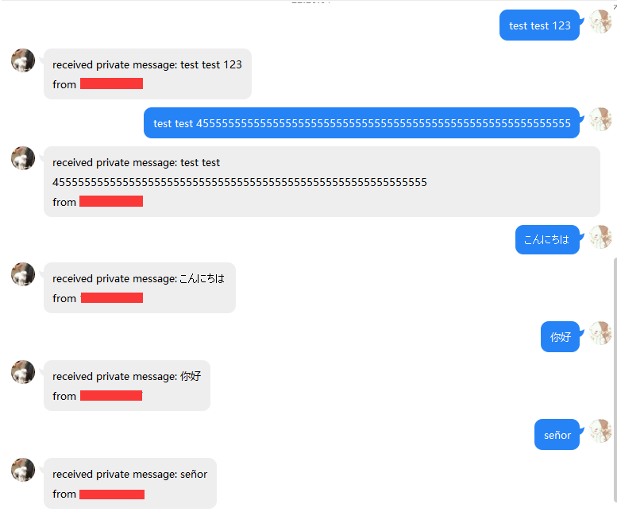
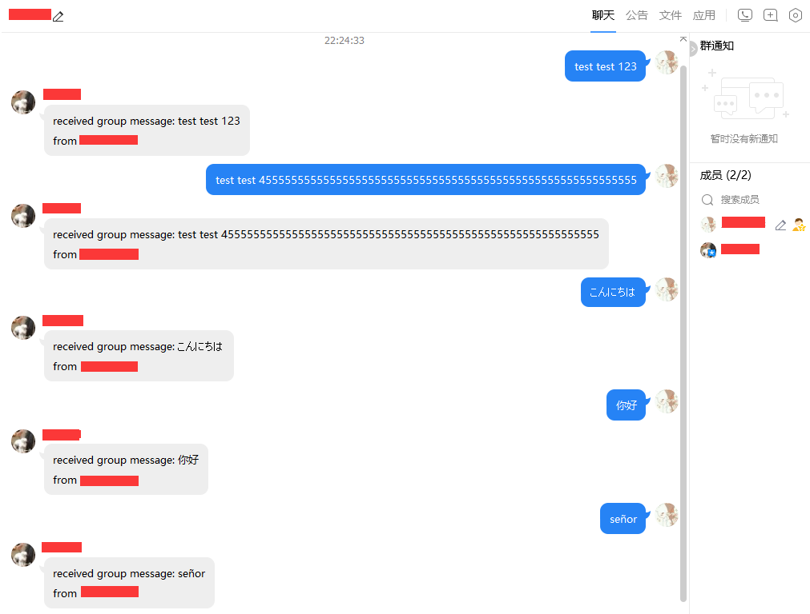

# SQQRobot

sqqrobot is an qq(Tencent qq) robot python api, based on [CQA](https://cqp.cc/) and its plugin [CQSocket](https://github.com/yukixz/cqsocketapi), CQSocket has been attached in project root `org.dazzyd.cqsocketapi.cpk`.

## Usage

User can define his own message handler function easily by using **decorator**```@QQbot.as_pipe```

```python
@bot.as_pipe
def handler(message: QQbot.Message) -> Optional[QQbot.Message]:
    ...
```

To handle different message type, sqqrobot assembled five type. It will be taken as argument `message` of the handler function.

```python
class PrivateMessage(Message):
    def __init__(self, qq: str, message: str):
        ...

class GroupMessage(Message):
    def __init__(self, group_id: str, message: str, qq: str = ''):
        ...


class DiscussMessage(Message):
    def __init__(self, discuss_id: str, message: str, qq: str=''):
        ...


class GroupMemberDecrease(Message):
    def __init__(self, group_id: str, qq: str, operated_qq: str):
        ...


class GroupMemberIncrease(Message):
    def __init__(self, group_id: str, qq: str, operated_qq: str):
        ...
```

First three types enables as personal defined sending type.

The handler function is not parallel, the way to handle a message like a water(message) flows through the pipe(handler functions), if one of the handler function returns `None`. This message will treat as handled, or else the return of the handler function will be handled by next handler function.

## Quick Start

Plugin CQSocket must be loaded by CQA.

```python
from sqqrobot.qqbot import QQbot
from sqqrobot import qqbot
from typing import *

bot = QQbot(23333, 11235)


@bot.as_pipe
def private_handler(message: qqbot.PrivateMessage) -> Optional[qqbot.Message]:
    if not isinstance(message, qqbot.PrivateMessage):
        return message
    message_back: qqbot.PrivateMessage = qqbot.PrivateMessage(message.qq,
                                                              f'received private message: {message.message}\n'
                                                              f'from {message.qq}')
    bot.send_message(message_back)


@bot.as_pipe
def group_handler(message: qqbot.GroupMessage) -> Optional[qqbot.Message]:
    if not isinstance(message, qqbot.GroupMessage):
        return message
    message_back = qqbot.GroupMessage(message.group_id, f'received group message{message.message}\n'
                                                        f'from {message.group_id}')
    bot.send_message(message_back)


if __name__ == '__main__':
    bot.serve()
```

### Result

Private conversation



Group conversation

